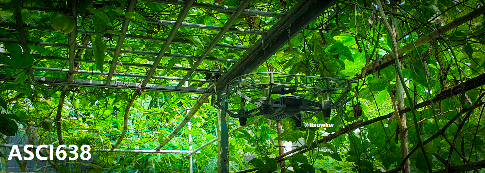

## Welcome to my ASCI638 blog!
I am liauwkw, a graduate student from Embry-Riddle Aeronautical University - Worldwide. This blog was created in fulfillment of the ASCI 638 module: Human Factors in Unmanned Aerospace Systems, as part of the MSc Aeronautics program.

## Topical Discussions
* [UAS Human Factors](https://gist.github.com/liauwkw/4a08f0cf2f38131d6f173b83ea768bcb)
* [The Hub](https://gist.github.com/liauwkw/975049a6d9407bf01539f1506d2d50f8)
* UAM, UTM and NextGen(NAS)
* Risk Management and ADM
* Physiological Issues in UAS
* UAS and Manned Aircraft Autonomy
* UAS Mishaps and Accidents
* UAS Crewmember/Operator Requirements

## Experiments
* [YOLOv5 Retrained on Passionfruit Dataset](https://github.com/liauwkw/pfruit)
* [Preliminary Cost-effectiveness Study of ROS Gazebo](https://github.com/liauwkw/ASCI638/blob/main/Gazebo.md)

Contact liauwk@my.erau.edu.
